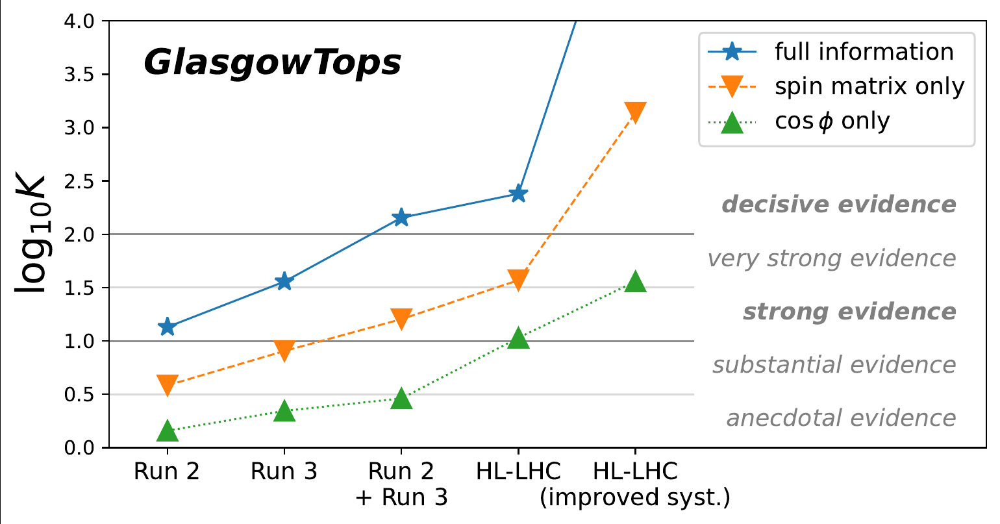

# Physics

In my work within the ATLAS Collaboration at CERN, I am involved in several different areas.

## Top Physics

Our research group focuses on measurements and phenomenological studies of the top quark, the heaviest fundamental particle ever discovered. Precise measurements of top quark properties allow us to stringently test the Standard Model of Particle Physics, tune our simulations, and probe theories of New Physics...

